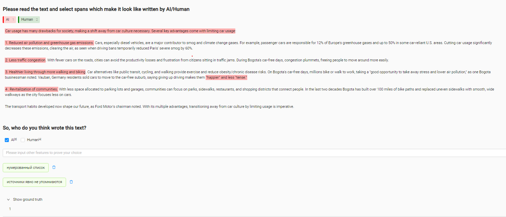

# Модуль 2. Разметка данных

## Датасет и поставновка задачи
Датасет состоял из двух частей: 
1. датасет с [соревнования](https://www.kaggle.com/competitions/llm-detect-ai-generated-text/data), в котором мы участвуем с командой: содержит эссе, написанные людьми;
2. эссе на ту же тему, сгенерированные языковой моделью Claude.  

Подготовку датасета см. в ноутбуке `annotation.ipynb`.

У данных уже есть natural labels: мы знаем какие тексты сгенерированы, а какие нет. Поэтому разметка в обычном понимании здесь не требуется. Однако нам хотелось:
1. Понять, сможем ли мы сами отличать такие тексты?
2. Найти отличия, которые можно потом использовать в качестве признаков для машинного обучения.

## Процесс разметки
Разметка производилась с помощью инструмента [LabelStudio](https://labelstud.io/).
Вот как выглядел интерфейс разметки:  

Здесь можно выделять фрагменты, которые кажутся разметчику характерными для сгенерированных/человеческих текстов, а также записывать найденные отличия в свободной форме. 
Также во время разметки предлагается "угадать", кем написан текст.  
После первой итерации разметки была получена обратная связь и выяснилось, что сгенерированные и человеческие тексты довольны похожи, и отличать одно от другого бывает трудно. 
Поэтому в интерфейс была добавлена возможность посмотреть правильный ответ. 
Решение может показаться странным, но нашей целью все-таки было понять, чем тексты отличаются, а знание источника текста может повлиять на его восприятие и поиск отличительных черт.  
Финальный вариант инструкции для разметки см. в `instructions.txt`.

## Результаты
В разметке приняло участие 4 человека. 
Всего было размечено 35 текстов.
6 из них оказались размечены неверно.  
На основе собранной разметки удалось составить список признаков, отличающих сгенерированные тексты от человеческих.
Цель разметки в этом и состояла, поэтому можно сказать, что в каком-то виде она была достигнута, хотя, скорее всего, нам понадобятся еще несколько итераций разметки.  
Более подробно c результатами разметки можно ознакомиться в ноутбуке `annotation.ipynb`.

## Проблемы и ограничения
1. Так как сроки были ограничены, не получилось собрать разметку с перекрытием и посчитать согласованность. 
Кроме того, число текстов, размеченных некоторым асессорами недостаточно для того, чтобы сделать выводы о качестве их разметки.
2. Другая причина, по которой неизвестно, насколько можно доверять оценки качества разметки: у асессоров была возможность видеть правильный ответ, т.е. они могли изменить свой ответ в любой момент (хотя в инструкции и есть просьба не делать этого). 
Остается полагаться только на честность:)
3. Идея с выделением фрагментов оказалась не очень удачной для последующего анализа, т.к. не всегда понятно, почему разметчик выделил тот или иной фрагмент и в целом это требует погружения в контекст каждого эссе. 
Признаки, перечисляемые в свободной форме, лучше помогают составить общую картину. 
Но с ними тоже есть проблема: свободная форма ответов привела к наличию синонимичных признаков. 
Однако эту проблему можно будет разрешить в будущем, зафиксировав список признаков.

